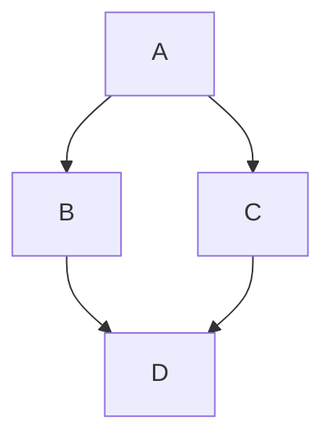
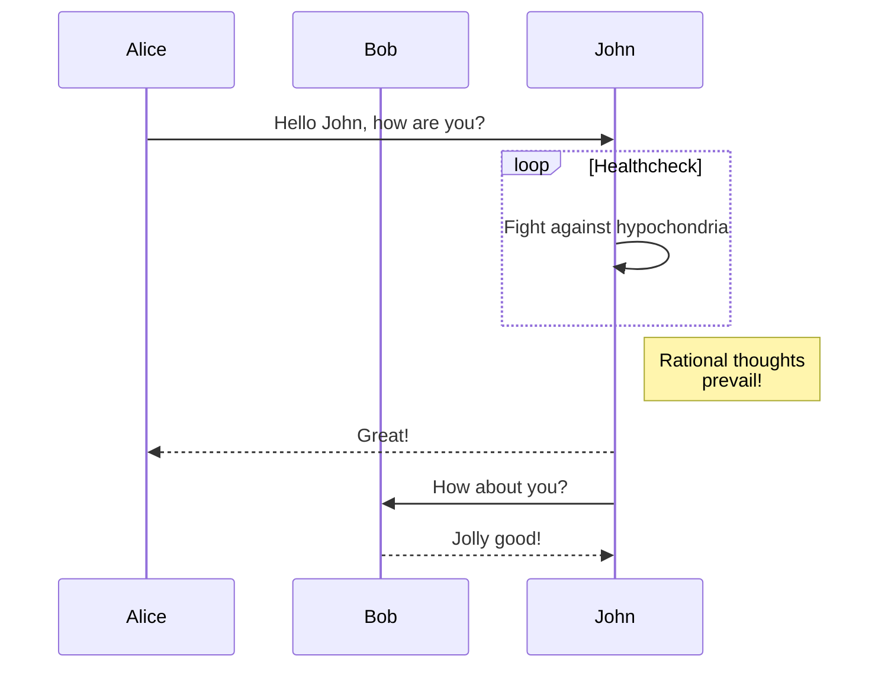
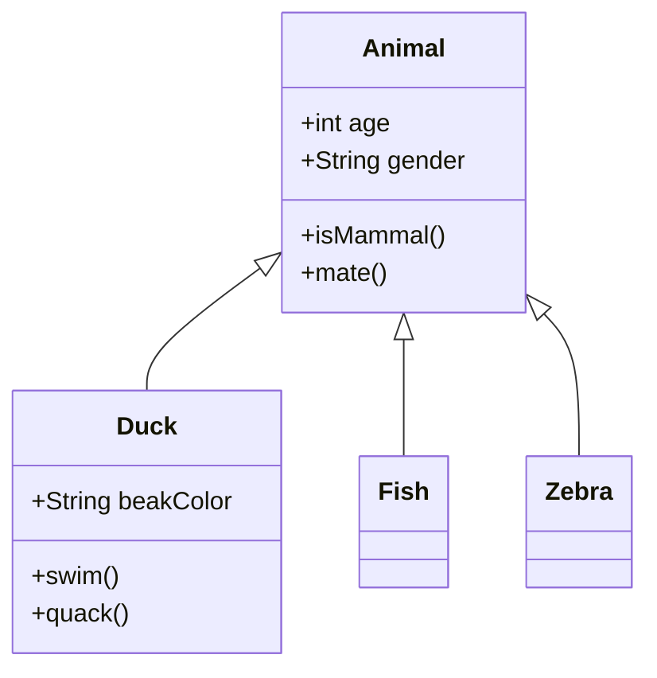
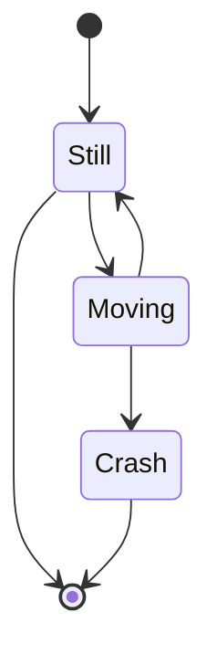
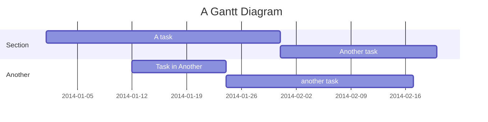
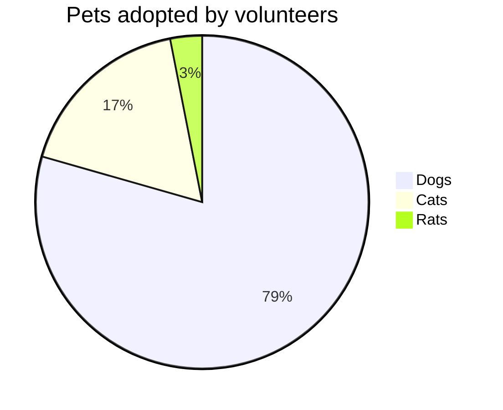

# GitHub Markdown Features
Sources: GitHub GFM Spec, GitHub Blog, GitHub Official Docs

## Alerts
Use alerts to emphasize critical information. They render with distinct icons and colors in GitHub's UI.

### Syntax
```markdown
> [!NOTE]
> Highlights information that users should know even when skimming.

> [!TIP]
> Provides helpful advice for doing things more effectively.

> [!IMPORTANT]
> Crucial information users need to know to avoid pitfalls.

> [!WARNING]
> Critical content demanding immediate user attention due to potential risks.

> [!CAUTION]
> Negative consequences of an action.
```

## Mermaid Diagrams
GitHub natively renders Mermaid.js diagrams within code blocks.

### Flowchart
```markdown

```

### Sequence Diagram
```markdown

```

### Class Diagram
```markdown

```

### State Diagram
```markdown

```

### Gantt Chart
```markdown

```

### Pie Chart
```markdown

```

### GitGraph
```markdown

```

## Mathematical Expressions
Render LaTeX math using dollar sign delimiters or specialized code blocks.

### Inline Math
```markdown
The Cauchy-Schwarz Inequality: $\left( \sum_{k=1}^n a_k b_k \right)^2 \leq \left( \sum_{k=1}^n a_k^2 \right) \left( \sum_{k=1}^n b_k^2 \right)$
```

### Block Math
```markdown
$$
L = \frac{1}{2} \rho v^2 S C_L
$$
```

### Math Code Block
```markdown
```math
e^{i\pi} + 1 = 0
```
```

## Dark and Light Mode Images
Use the `<picture>` element to serve different images based on the user's GitHub theme preference.

### Syntax
```markdown
<picture>
  <source media="(prefers-color-scheme: dark)" srcset="https://user-images.githubusercontent.com/dark-mode-logo.png">
  <source media="(prefers-color-scheme: light)" srcset="https://user-images.githubusercontent.com/light-mode-logo.png">
  
</picture>
```

## Collapsible Sections
Use HTML `<details>` and `<summary>` tags to hide large blocks of content, such as logs or long lists.

### Basic Toggle
```markdown
<details>
  <summary>Click to expand</summary>

  Hidden content goes here. You can use **Markdown** inside.
</details>
```

### Nested Toggle
```markdown
<details>
  <summary>Outer Layer</summary>

  Text in outer layer.

  <details>
    <summary>Inner Layer</summary>

    Deeply nested content.
  </details>
</details>
```

## Tables
Standard GFM tables with alignment and formatting.

### Alignment and Basic Syntax
```markdown
| Left Aligned | Center Aligned | Right Aligned |
| :---         |     :---:      |          ---: |
| Content      | Content        | Content       |
```

### Formatting Inside Cells
You can use inline markdown inside table cells, including links, bold text, and code.
```markdown
| Feature | Status | Note |
| :--- | :---: | :--- |
| **Auth** | Yes | Works with `JWT` |
| [API](docs/api.md) | In Progress | Under construction |
```

### Escaping Pipes
If you need to include a pipe `|` inside a table cell, use the HTML entity `&#124;` or escape it with a backslash `\|`.

## Task Lists
Interactive checkboxes used for checklists and progress tracking.

### Syntax
```markdown
- [x] Completed task
- [ ] Incomplete task
  - [ ] Nested task 1
  - [x] Nested task 2
```

## Syntax Highlighting
GitHub supports syntax highlighting for over 200 languages.

### Language Annotation
```markdown
```typescript
const hello = "world";
```
```

### Diff Highlighting
Useful for showing code changes.
```markdown
```diff
- const old = true;
+ const current = true;
```
```

## Footnotes
Reference information at the bottom of the document without interrupting the flow.

### Syntax
```markdown
Here is a simple footnote[^1]. With more text[^longnote].

[^1]: This is the first footnote.
[^longnote]: This is a longer footnote with more detail.
```

## Keyboard Tags
Style keyboard shortcuts using the `<kbd>` element.

### Syntax
```markdown
Press <kbd>Ctrl</kbd> + <kbd>C</kbd> to copy.
```

## Subscript and Superscript
Use HTML tags for mathematical or chemical notations.

### Syntax
```markdown
H<sub>2</sub>O
X<sup>2</sup> + Y<sup>2</sup> = Z<sup>2</sup>
```

## Color Swatches
Display color previews by wrapping hex codes in backticks.

### Syntax
```markdown
The primary color is `#3B82F6`.
Background is `#FFFFFF`.
```

## Emoji Shortcodes
GitHub renders emoji shortcodes into visual icons.

### Syntax
```markdown
:rocket: :shipit: :heavy_check_mark:
```

## Links and Anchors
GitHub automatically generates anchors for all headings.

### Relative Links
Link to files within the same repository.
```markdown
[Read the Docs](docs/setup.md)
[View Image](assets/logo.png)
```

### Anchor Links
Link to a specific section on the same page. GitHub slugsify headings (lowercase, replace spaces with hyphens, remove special characters).
```markdown
[Jump to Tables](#tables)
[Jump to Task Lists](#task-lists)
```

## Image Sizing and Alignment
While standard Markdown images `` do not support sizing, HTML `` tags do.

### Sizing
```markdown

```

### Alignment
Wrap in a `div` with an `align` attribute.
```markdown
<div align="center">
  
  <p>Centered caption</p>
</div>
```

## HTML Support
GitHub allows a subset of HTML tags for security reasons.

### Allowed Tags
- `<a>`, `<b>`, `<blockquote>`, `<code>`, `<dd>`, `<del>`, `<details>`, `<div>`, `<dl>`, `<dt>`, `<em>`, `<h1>` to `<h6>`, `<hr>`, `<i>`, ``, `<ins>`, `<kbd>`, `<li>`, `<ol>`, `<p>`, `<pre>`, `<s>`, `<sub>`, `<sup>`, `<summary>`, `<sup>`, `<table>`, `<tbody>`, `<td>`, `<th>`, `<thead>`, `<tr>`, `<ul>`, `<var>`

### Stripped Elements
- `<script>`, `<style>`, `<iframe>`, `<object>`, `<embed>`, `<form>`
- Most event handlers (`onclick`, etc.) and JavaScript-related attributes are removed.

## GeoJSON and TopoJSON Maps
GitHub renders GeoJSON and TopoJSON files as interactive maps when used in code blocks.

### Syntax
```markdown
```geojson
{
  "type": "FeatureCollection",
  "features": [
    {
      "type": "Feature",
      "id": 1,
      "properties": {
        "ID": 1
      },
      "geometry": {
        "type": "Polygon",
        "coordinates": [
          [
              [-90,35], [-90,30], [-85,30], [-85,35], [-90,35]
          ]
        ]
      }
    }
  ]
}
```
```

## STL 3D Models
GitHub renders STL files as interactive 3D models when placed in a code block.

### Syntax
```markdown
```stl
solid
  facet normal 0 0 0
    outer loop
      vertex 0 0 0
      vertex 1 0 0
      vertex 1 1 0
    endloop
  endfacet
endsolid
```
```

## GitHub-Specific References
Automatic linking for common GitHub entities.

### Syntax
```markdown
- @username: Mentions a user or team
- #123: Links to an issue or pull request
- gh-123: Alternative issue/PR syntax
- d18f03c: Links to a specific commit SHA
- user/repo#123: Cross-repository reference
```

## Comments
Markdown comments are not rendered in the browser.

### Syntax
```markdown
<!-- This is a hidden comment -->
```

## Feature Support Matrix
Different areas of GitHub support different subsets of GFM features.

| Feature | README | Issues | PRs | Discussions | Wiki |
| :--- | :---: | :---: | :---: | :---: | :---: |
| Basic Markdown | Yes | Yes | Yes | Yes | Yes |
| Mermaid Diagrams | Yes | Yes | Yes | Yes | Yes |
| Math Expressions | Yes | Yes | Yes | Yes | Yes |
| Alerts | Yes | Yes | Yes | Yes | Yes |
| GeoJSON Maps | Yes | Yes | Yes | Yes | Yes |
| STL 3D Models | Yes | Yes | Yes | Yes | Yes |
| Interactive Tasks | No* | Yes | Yes | No* | No |
| Picture Element | Yes | Yes | Yes | Yes | Yes |

*\*Task lists render as checkboxes but are not interactive (cannot be clicked to update) in READMEs or Discussions.*

## Quick Reference
Summary of syntax for frequent documentation tasks.

| If you need to... | Use this syntax... |
| :--- | :--- |
| Show a keyboard key | `<kbd>Shift</kbd>` |
| Hide details | `<details><summary>Text</summary>...</details>` |
| Prevents dark mode logo clashing | `<picture>` with `prefers-color-scheme` |
| Link to a code line | `[text](URL#L100)` |
| Highlight a change | ` ```diff ` code block |
| Preview a color | `` `#HEX` `` in backticks |
| Show an architectural flow | ` ```mermaid ` flowchart |
| Create a chemical formula | `H<sub>2</sub>O` |
| Add a "Pro-Tip" box | `> [!TIP]` alert |
| Reference a specific commit | Paste the first 7 chars of the SHA |
| Center an image | `<div align="center"></div>` |
| Add a table footnote | `[^1]` markers |
| Show a progress bar | Mermaid Gantt or custom SVG/Image |
| Group images horizontally | Use a `<table>` with `` in cells |
