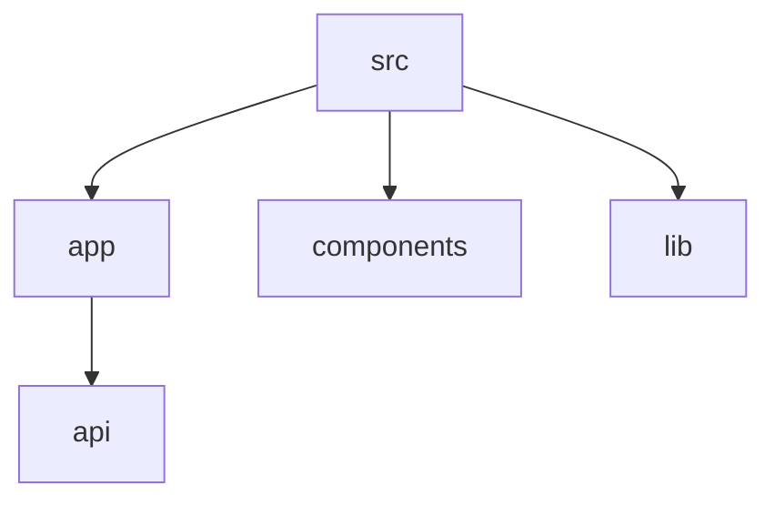

# README Templates
Sources: React, tRPC, Got, Bun, Biome, Drizzle README patterns, awesome-readme analysis

These templates provide standardized structures for high-quality GitHub documentation. They incorporate modern GitHub Markdown features to ensure clarity, scannability, and visual appeal. Use these templates as starting points and customize them according to project requirements.

## 1. Library/Package Template
Use this template for libraries, utilities, or packages distributed via package managers like npm, PyPI, or Crates.io.

```markdown
<div align="center">
  
  <h1>[Project Name]</h1>
  <p><strong>[A short, powerful one-sentence tagline that explains the value proposition.]</strong></p>
  <p>
    <a href="https://www.npmjs.com/package/[package-name]"></a>
    <a href="https://github.com/user/repo/blob/main/LICENSE"></a>
    <a href="https://github.com/user/repo/actions"></a>
  </p>
  <p>
    <a href="#quick-start">Quick Start</a> • <a href="#usage">Usage</a> • <a href="#api-reference">API</a> • <a href="https://docs.example.com">Full Docs</a>
  </p>
</div>

<hr />

### What is [Project Name]?
[2-3 sentences explaining exactly what the library does, the problem it solves, and why it is better than existing alternatives. Focus on the primary benefit.]

### Features
- ✨ **[Feature 1]:** [Brief description of the feature and its impact.]
- 🚀 **[Feature 2]:** [Brief description of the feature and its impact.]
- 🔒 **[Feature 3]:** [Brief description of the feature and its impact.]
- 📦 **[Feature 4]:** [Brief description of the feature and its impact.]

### Quick Start
Get started with [Project Name] in less than 30 seconds.

```bash
npm install [package-name]
```

```javascript
import { start } from '[package-name]';

const result = start({ key: 'value' });
console.log(result);
// Expected Output: { status: 'success', data: ... }
```

### Installation
<details><summary><b>npm</b></summary>

```bash
npm install [package-name]
```
</details>
<details><summary><b>yarn</b></summary>

```bash
yarn add [package-name]
```
</details>
<details><summary><b>pnpm</b></summary>

```bash
pnpm add [package-name]
```
</details>
<details><summary><b>bun</b></summary>

```bash
bun add [package-name]
```
</details>

### Usage
#### Basic Example
```javascript
// Simple use case example
```
#### Advanced Example
```javascript
// Complex scenario with config
```

### API Reference
| Method | Parameters | Description |
| :--- | :--- | :--- |
| `init(config)` | `Object` | Initializes the library with settings. |
| `process(data)` | `Any` | Processes input data and returns a promise. |

> [!TIP]
> View the [Full Documentation](https://docs.example.com) for detailed type definitions.

### Comparison
| Feature | [Project Name] | Alternative A | Alternative B |
| :--- | :---: | :---: | :---: |
| Performance | ⚡ High | Medium | Low |
| Bundle Size | 🤏 2kb | 15kb | 50kb |

### Contributing
Contributions are welcome! Please read our [Contributing Guide](CONTRIBUTING.md).

### License
This project is licensed under the [MIT License](LICENSE).
```

## 2. CLI Tool Template
Use this template for command-line interfaces, dev tools, and automated utilities.

```markdown
<div align="center">
  
  <h1>[CLI Name]</h1>
  <p><strong>[A clear one-liner describing the CLI's main function.]</strong></p>
  <p>
    <a href="https://github.com/user/repo/releases/latest"></a>
    
  </p>
</div>

<hr />

### What does it do?
[Project Name] is a blazingly fast terminal tool for [specific task]. It automates [process] and integrates seamlessly into your existing workflow.

### Features
- ⚡ **Performance:** [Description of speed or efficiency.]
- 🎨 **Output:** [Description of terminal UI or formatting.]
- 🛠️ **Configurable:** [Description of extensibility.]

### Quick Start
```bash
# Install via npm
npm install -g [cli-name]

# Run first command
[cli-name] init

# Expected Output:
# [info] Initializing configuration...
# [success] Created .[cli-name]rc.json
```

### Installation
#### Homebrew
```bash
brew install user/tap/[cli-name]
```
#### npm
```bash
npm install -g [cli-name]
```
#### Binary
Download from the [Releases page](https://github.com/user/repo/releases).

### Commands
| Command | Description | Example |
| :--- | :--- | :--- |
| `init` | Initialize a new project | `[cli-name] init` |
| `run <file>` | Process a specific file | `[cli-name] run main.json` |

### Configuration
Create a `[cli-name].config.js` file in your root directory.
```javascript
module.exports = {
  theme: 'dark',
  verbose: true
};
```

### Examples
#### Continuous Integration
```yaml
- name: Run [CLI Name]
  run: [cli-name] run ./dist --ci
```
#### Batch Processing
```bash
[cli-name] run ./input/*.txt --output=./results
```

### Contributing
See [CONTRIBUTING.md](CONTRIBUTING.md) for local setup instructions.

### License
[MIT](LICENSE) © [Your Name]
```

## 3. API Service/SDK Template
Use this template for software development kits (SDKs) and wrappers for cloud services or REST APIs.

```markdown
<div align="center">
  
  <h1>[SDK Name]</h1>
  <p><strong>[One-line description of the API/service being wrapped.]</strong></p>
  <p>
    <a href="https://status.example.com"></a>
    <a href="https://github.com/user/repo/releases"></a>
  </p>
</div>

<hr />

### Features
- 🛡️ **Type-safe:** Full TypeScript support for all endpoints.
- 🔄 **Auto-retry:** Built-in exponential backoff.
- 📊 **Streaming:** Support for large data transfers.

### Quick Start
1. **Install**
   ```bash
   npm install [sdk-package]
   ```
2. **Authenticate**
   Obtain your API Key from the [Dashboard](https://example.com/dashboard).
3. **Call**
   ```javascript
   import { Client } from '[sdk-package]';
   const client = new Client({ apiKey: 'YOUR_KEY' });
   const user = await client.users.get('id_123');
   ```

### Authentication
> [!IMPORTANT]
> Never hardcode your API Key in your source code. Use environment variables.
```javascript
const client = new Client({
  apiKey: process.env.API_KEY,
  environment: 'production'
});
```

### API Reference
| Endpoint | Method | Description |
| :--- | :--- | :--- |
| `/users` | `client.users.list()` | List all users. |
| `/orders` | `client.orders.create()` | Create a new order. |

### Full Example
```javascript
const response = await client.orders.create({
  items: [{ id: 'item_1', qty: 2 }]
});
```

#### Response Object
```json
{
  "id": "ord_555",
  "status": "pending"
}
```

### Error Handling
```javascript
try {
  await client.users.get('not_found');
} catch (error) {
  if (error instanceof NotFoundError) {
    // Handle 404
  }
}
```

### Rate Limiting
The API has a limit of 100 requests per minute. Use `getRateLimitStatus()` to check quota.

### Contributing
Read our [contributing guidelines](CONTRIBUTING.md).

### License
[Apache 2.0](LICENSE)
```

## 4. Framework/Application Template
Use this template for web frameworks, boilerplates, or full-stack applications.

```markdown
<div align="center">
  
  <h1>[App Name]</h1>
  <p><strong>[A short, catchy tagline summarizing the app's purpose.]</strong></p>
  <p>
    <a href="https://demo.example.com"></a>
    <a href="https://github.com/user/repo/actions"></a>
  </p>
</div>

<hr />

### Features
<div align="center">
  <table>
    <tr>
      <td width="50%">
        
        <br /><b>[Feature 1]</b><br />[Short description.]
      </td>
      <td width="50%">
        
        <br /><b>[Feature 2]</b><br />[Short description.]
      </td>
    </tr>
  </table>
</div>

### Prerequisites
- Node.js >= 18.0.0
- Docker (optional)

### Quick Start
1. **Clone and Install**
   ```bash
   git clone https://github.com/user/repo.git
   cd repo
   npm install
   ```
2. **Environment Setup**
   ```bash
   cp .env.example .env
   ```
3. **Run Development Server**
   ```bash
   npm run dev
   ```

Visit `http://localhost:3000` to see the app in action.


### Project Structure


### Configuration
| Property | Default | Description |
| :--- | :--- | :--- |
| `name` | "My App" | The application name. |
| `theme` | "system" | The default theme mode. |

### Deployment
#### Vercel
Push to `main` branch to automatically trigger a deployment.
#### Docker
```bash
docker build -t [app-name] .
docker run -p 3000:3000 [app-name]
```

### Contributing
Check the [Issues](https://github.com/user/repo/issues) page to find tasks.

### License
This project is licensed under the [MIT License](LICENSE).
```

## Template Customization Guide

Applying the correct template is the first step in creating high-quality documentation. Use the following guidelines to customize the output for specific project needs.

### Decision Tree: Template Selection

| If the project is a... | Then use the... |
| :--- | :--- |
| Standalone utility or library | **Library/Package Template** |
| Command-line tool or automated script | **CLI Tool Template** |
| Wrapper for an external service or API | **API Service/SDK Template** |
| Full web app, dashboard, or SaaS starter | **Framework/Application Template** |
| Monorepo containing multiple of the above | **Monorepo Strategy (see below)** |

### Adapting for Project Size

The depth of your README should scale with the complexity of the code.

#### Small Projects (Utilities, Small Libraries)
- **Simplify:** Remove the comparison table and the advanced usage sections.
- **Focus:** Keep the installation and the primary code example.
- **Merge:** Combine features and "What is it?" into a single introductory section.

#### Large Projects (Frameworks, Enterprise SDKs)
- **Deepen:** Add a "Why?" section explaining architectural decisions.
- **Externalize:** Move detailed API references to a dedicated `docs/` folder or site.
- **Structure:** Use Mermaid diagrams to explain internal data flows or architecture.

### Monorepo Documentation Strategy

In a monorepo (e.g., using Turborepo, Nx, or Lerna), you must manage multiple READMEs.

1. **Root README:** Use the **Framework/Application Template** structure. Focus on the project as a whole, repository structure, and development setup for contributors. Include a table linking to all packages in the `packages/` directory.
2. **Package READMEs:** Use the **Library/Package Template** for each individual package in the subdirectories. These should be self-contained for users who only install that specific package.
3. **Internal Tools:** Use the **CLI Tool Template** for any developer productivity tools stored within the repository.
