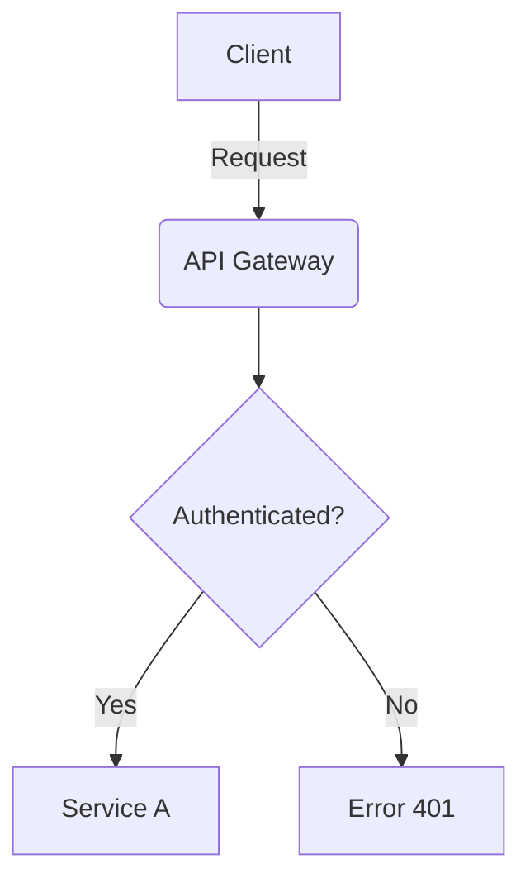
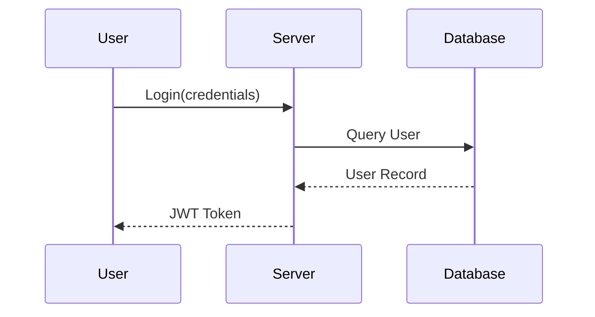
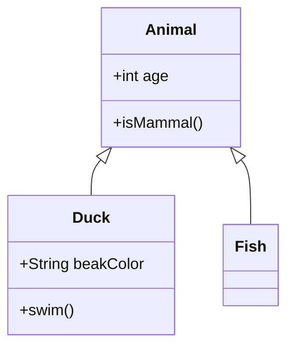
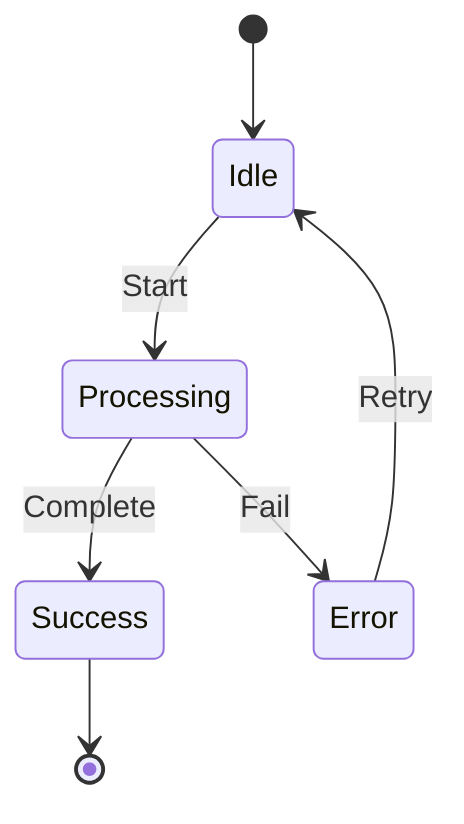
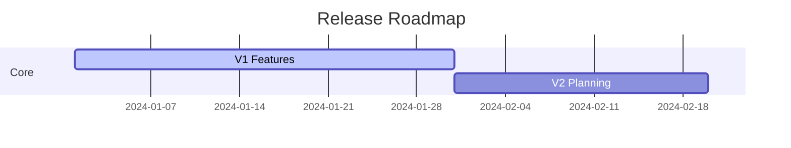
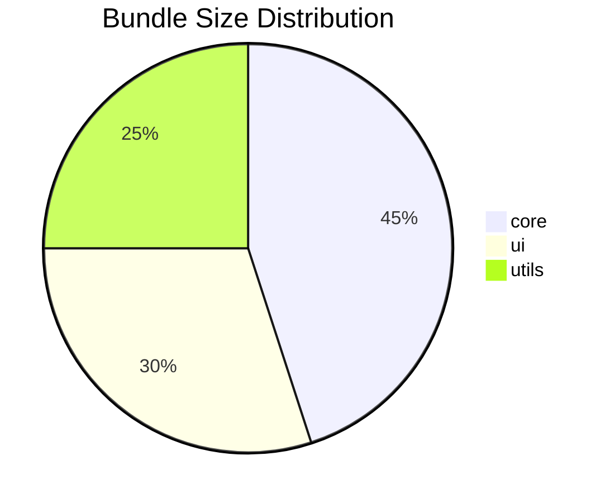
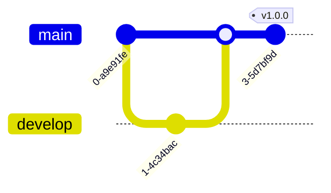

# Visual Elements
Sources: shields.io documentation, Mermaid.js docs, GitHub official docs, top library README analysis

Visual design in GitHub documentation serves as a non-verbal communication layer that establishes trust, signals project maturity, and improves information scannability. Use the following standards to create documentation that competes with top-tier open-source projects.

## Badge Strategy

Badges provide "at-a-glance" status and social proof. They must be used strategically to avoid visual clutter.

### The Badge Bar Pattern

Consolidate badges into a single, centered row immediately following the hero logo and tagline. 

- **Quantity**: Aim for 4-7 badges. 
- **Alignment**: Wrap the badge list in `<div align="center">` to match the hero section.
- **Priority**: Organize badges by their utility to the user:
  1. **Build Status**: CI success/failure (Crucial for trust).
  2. **Stability**: Version number (npm, PyPI, Crates.io).
  3. **Quality**: Code coverage percentage.
  4. **Usage**: Download counts or installation stats.
  5. **Legal**: License type.
  6. **Community**: Discord/Slack links or GitHub Stars.

### Shields.io Syntax

Use shields.io for consistent styling across all badges.

| Component | Pattern | Example |
|-----------|---------|---------|
| Static | `https://img.shields.io/badge/<LABEL>-<MESSAGE>-<COLOR>` | `.../badge/build-passing-brightgreen` |
| Dynamic (npm) | `https://img.shields.io/npm/v/<PACKAGE>` | `.../npm/v/express` |
| GitHub | `https://img.shields.io/github/stars/<USER>/<REPO>` | `.../github/stars/facebook/react` |
| Style Override | `?style=<STYLE>` | `?style=flat-square` |

### Badge Styles

Standardize on a single style across the entire documentation set.

- **Flat**: The modern standard (default). Use for most projects.
- **Flat-Square**: Sharp edges, more technical/industrial feel.
- **Plastic**: Glossy finish. Avoid in modern documentation.
- **For-the-badge**: Oversized, capital letters. Use only for high-impact hero sections.
- **Social**: Specifically for stars, forks, or followers.

### Custom Badge Logic

Construct custom badges to highlight unique project metrics or requirements.
- **Syntax**: `https://img.shields.io/badge/<LABEL>-<MESSAGE>-<COLOR>?logo=<ICON_NAME>&logoColor=white`
- **Colors**: Use hex codes for brand alignment (e.g., `#3B82F6` for primary blue).
- **Logos**: Reference SimpleIcons names for the `logo` parameter.

### Badge Noise Anti-Pattern

Do not exceed 10-12 badges in the hero section. Excessive badging:
- Dilutes the impact of critical signals (like build failure).
- Increases initial page load time.
- Signals a focus on vanity metrics over utility.
- Breaks mobile rendering by wrapping onto too many lines.

## Hero Section Visual Design

The hero section is the primary entry point. It must be high-contrast and centered.

### Centered Layout

Use a `div` wrapper with `align="center"` to group the logo, tagline, and badges.

```html
<div align="center">
  
  <h1>Project Name</h1>
  <p><b>A single-sentence value proposition that defines the core utility.</b></p>
  <!-- Badges go here -->
</div>
```

### Logo Guidelines

- **Format**: Prefer SVG for crisp rendering on high-DPI screens.
- **Size**: Set a fixed width between 200px and 400px using the `width` attribute.
- **Transparency**: Ensure logos have transparent backgrounds to support both light and dark themes.

### Tagline Formatting

The tagline should be the most prominent text after the title.
- **Bold**: Wrap the tagline in `<b>` or `**`.
- **Blockquote**: Use a blockquote for longer, more descriptive taglines if they require visual separation from the title.

### Quick Links Navigation

Include a horizontal list of links to major documentation sections.
- **Pattern**: Bullet-separated or pipe-separated.
- **Location**: Place immediately below the badge bar.
- **Links**: Installation, Usage, API Reference, Contributing.

```markdown
[Installation](#installation) • [Usage](#usage) • [API Reference](docs/api.md) • [Contributing](CONTRIBUTING.md)
```

## Dark and Light Mode Support

GitHub provides theme-aware rendering. Documentation must account for users switching between light and dark modes to maintain readability.

### Theme-Aware Images

Implement the `<picture>` element to serve different image versions based on the user's system preference. This is critical for logos or diagrams that lack transparency.

```html
<picture>
  <source media="(prefers-color-scheme: dark)" srcset="logo-dark.png">
  <source media="(prefers-color-scheme: light)" srcset="logo-light.png">
  
</picture>
```

### Strategy for Theme Variants

- **Logo**: If the primary logo color clashes with a dark background, provide a "Dark Mode" version with inverted colors or high-contrast outlines.
- **Diagrams**: Export Mermaid diagrams or screenshots with high contrast to ensure readability in both modes without needing separate assets.
- **SVG Advantage**: Use SVGs with CSS-defined colors (`currentColor`) to automatically adapt to the text color of the theme.

## Mermaid Diagram Selection Guide

Diagrams reduce cognitive load by visualizing complex logic. Use the following selection framework to choose the appropriate Mermaid type.

### Diagram Decision Tree

- **Process/Logic Flow**: Flowchart (`graph`)
- **API/Object Interaction**: Sequence Diagram (`sequenceDiagram`)
- **Data Structure/Types**: Class Diagram (`classDiagram`)
- **State Changes**: State Diagram (`stateDiagram-v2`)
- **Project Timeline**: Gantt Chart (`gantt`)
- **Usage Statistics**: Pie Chart (`pie`)
- **Git Workflows**: Gitgraph (`gitGraph`)

### Flowcharts (Architecture/Logic)

Use for high-level system architecture or conditional logic.



### Sequence Diagrams (Interactions)

Use for documenting request/response lifecycles or distributed system communication.



### Class Diagrams (Hierarchy)

Use for documenting class relationships or TypeScript interface extensions.



### State Diagrams (Machines)

Use for complex components like UI modals, connection handlers, or long-running jobs.



### Gantt and Roadmaps

Use for public roadmap documentation in the project root or a separate ROADMAP.md.



### Pie Charts

Use for presenting performance distribution or module size statistics.



### Gitgraph

Use to explain branching strategies like GitFlow or Trunk-Based Development.



## Screenshots and GIFs

Visual media provides immediate context that text cannot.

### Selection Criteria

| Media Type | When to Use |
|------------|-------------|
| **Screenshot** | Static UI components, configuration panels, error states. |
| **GIF** | Short interactions (3-10s), terminal command execution, animations. |
| **Video Link** | Long tutorials, full product demos (Link to YouTube/Loom). |

### Quality Guidelines

- **Density**: Use standard resolution (72dpi or 96dpi). High-DPI screenshots often appear double-sized in browsers.
- **Sizing**: Constrain width to 800px max for better scannability.
- **Captions**: Use italicized text below the image to provide context.

### GIF Best Practices

- **Frame Rate**: Limit to 10-15 FPS to keep file size under 5MB.
- **Tools**: Use `ffmpeg` or specialized terminal recorders like `asciinema` (then convert to SVG or GIF).
- **Looping**: Ensure the GIF loops smoothly to avoid jarring transitions.

## Image Alignment and Sizing

Control the visual rhythm of the page by manipulating image placement.

### Syntax for Control

Use the `img` tag instead of standard Markdown `` when specific dimensions or alignment are required.

```html

```

### Alignment Patterns

- **Center**: Wrap in `<div align="center">`. Best for logos and full-width diagrams.
- **Right-Align**: Use `style="float: right; margin-left: 20px;"` inside an `img` tag. Use sparingly for small callout icons.
- **Responsive**: Omit height and set width to a percentage (e.g., `width="100%"`) for images that must scale across devices.

## Comparison Tables

Tables provide the fastest way for a user to evaluate a project's value proposition.

### Feature Comparison Pattern

Use checkmarks (`✓`) and crosses (`✗`) for binary features. 

| Feature | This Library | Competitor A | Competitor B |
|---------|:------------:|:------------:|:------------:|
| Performance | **Fastest** | Moderate | Slow |
| TypeScript | ✓ | ✓ | ✗ |
| Bundle Size | < 2kb | 15kb | 50kb |

### Performance Comparison

Use for benchmarking results. Bold the winning metric in each category.

| Scenario | Execution Time | Memory Usage |
|----------|----------------|--------------|
| Small Data | **0.5ms** | 12MB |
| Large Data | **45.2ms** | **150MB** |

## Visual Hierarchy Techniques

Structure content to guide the reader's eye through the document.

### Structural Breaks

- **Horizontal Rules**: Use `---` to separate major logical sections (e.g., between "Usage" and "API").
- **Blockquotes**: Use for "Pro-tips" or important warnings that need to stand out from standard paragraph text.

### Emphasis Hierarchy

- **Bold**: Apply bold formatting to keywords, primary action steps, and terminal commands to make them scannable.
- **Italic**: Use italics for secondary information, captions, or optional parameters to differentiate them from core instructions.

### Progressive Disclosure

Use the `<details>` and `<summary>` tags to hide low-priority technical details or large configuration examples.

```html
<details>
<summary><b>Click to see advanced configuration</b></summary>

```json
{
  "debug": true,
  "complexProperty": "value"
}
```
</details>
```

## Color and Formatting

### Color Swatches

GitHub renders a visual color preview when a hex code is placed inside backticks. This is essential for design system documentation or theme configurations.

- **Example**: `` `#7c3aed` `` will render as a small color block followed by the hex string.

### Alerts (Callouts)

Use GitHub's native alert syntax for critical information.

> [!NOTE]
> Useful information that users should know even when skimming.

> [!TIP]
> Helpful advice for doing things more efficiently.

> [!IMPORTANT]
> Key information users need to know to achieve success.

> [!WARNING]
> Urgent info that needs immediate user attention to avoid problems.

> [!CAUTION]
> Negative potential consequences of an action.

### Keyboard Shortcuts

Use the `<kbd>` tag to style keyboard inputs. This makes instructions for CLI tools or interactive web apps much clearer.

- **Pattern**: `<kbd>Cmd</kbd> + <kbd>Shift</kbd> + <kbd>P</kbd>`
- **Visual Effect**: Renders with a border and subtle shadow to mimic a physical key.

## Summary Checklist

- [ ] Does the hero section use a centered layout?
- [ ] Is the badge bar limited to 4-7 high-utility signals?
- [ ] Are all logos SVG or theme-aware via `<picture>`?
- [ ] Have Mermaid diagrams been chosen based on the decision tree?
- [ ] Are complex sections using `<details>` for progressive disclosure?
- [ ] Do comparison tables clearly highlight the library's advantages?
- [ ] Are alerts used sparingly for high-impact callouts?
